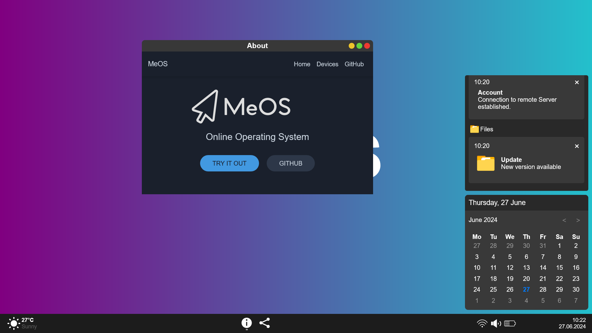
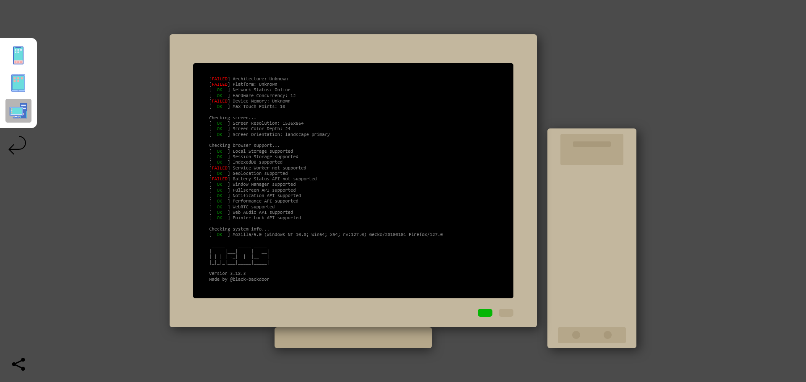

<h1 align="center">
    
</h1>

    

<h4 align="center">
    Online Operating System
</h4>

    <strong>
        <a href="https://meos.lima.zone/">Website</a>
        •
        <a href="https://github.com/black-backdoor/MeOS">GitHub</a>
    </strong>

## Features
- **Static** - No server-side code, only client-side JavaScript, HTML, and CSS.
- **Progressive Web App** - Can be installed on your device and used offline.
- **Mobile & Desktop** - Works on both mobile and desktop, with support for touch and mouse input.
- **Adaptive** - enables & disables features based on supported Browser APIs.
- **Dark Mode** - Supports dark mode, and changes the theme based on the system's theme.

## Screenshots

## Usage
You can use the online version of MeOS by visiting [meos.lima.zone](https://meos.lima.zone/).

## License
This project is licensed under the GNU General Public License v3.0 - see the [LICENSE](LICENSE) file for details.

I know that developers don't like to read licenses, so here is a [summery](https://choosealicense.com/licenses/gpl-3.0/):
- You are free to use, modify and distribute this software.
- You must disclose the source code of your modified version.
