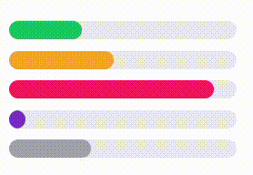

# `<ui-progress>` Component



## Usage

### Script
```html
<script src="/components/progress.js" type="module"></script>
```


### Body
```html
<ui-progress percent="42"></ui-progress>
```


## Properties

### CSS
- `--fill-color`: Color of the progress bar
- `--gb-color`: Background color of the progress bar
- `--text-color`: Color of the text


### Attributes
- `bar-style`: Style of the progress bar (default, round)
- `isIndeterminate`: If the progress bar is indeterminate
- `no-animation`: If the progress bar should not animate

```html
<ui-progress bar-style="round" isIndeterminate no-animation></ui-progress>
```


### Properties (JavaScript)
- `percent`: Percentage of the progress bar
- `label`: Label of the progress bar
